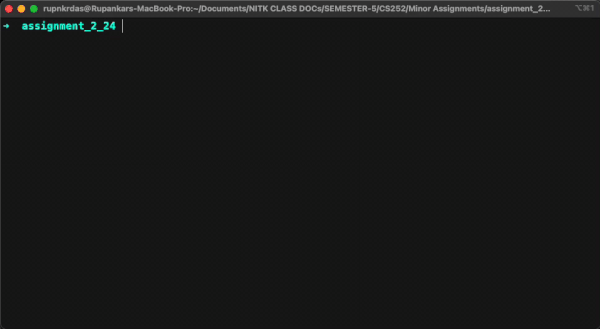
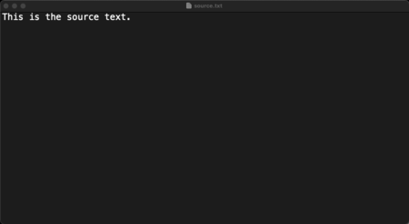
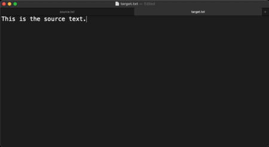
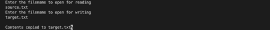

# Solution to Problem 2.24

## Kernel Specifications

Darwin Kernel Version 22.1.0

## Demo



## Screenshots

|                       source.txt                        |                     target.txt before                     |
| :-----------------------------------------------------: | :-------------------------------------------------------: |
|              |  |
|                    target.txt after                     |                     terminal snapshot                     |
|  |    |

## Running the command [dtruss](https://opensource.apple.com/source/dtrace/dtrace-147/DTTk/dtruss.auto.html) locally

**dtruss** command is not enabled on MacOS by default.  
System Integrity Protection must be disabled to enable **dtruss** usage.  
Refer [disabling_and_enabling_system_integrity_protection](https://developer.apple.com/documentation/security/disabling_and_enabling_system_integrity_protection) for more information.

Compile the program:

```
  gcc FileCopy.c
```

Run the the program tracing all the system calls:  
(using the **dtruss** command requires **admin privileges**, enter login password when prompted)

```
  sudo dtruss ./a.out
```

## Traced System Calls

- **munmap**  
  The munmap() system call deletes the mappings for the specified address range, causing further references to addresses within the range to generate invalid memory references.

- **open**  
  The open command opens a file (or a directory or URL), just as if you had double-clicked the file's icon. If no application name is specified, the default application as
  determined via LaunchServices is used to open the specified files.

- **fcntl**  
  fcntl() provides for control over descriptors.

- **close**  
  The close() call deletes a descriptor from the per-process object reference table.

- **fsgetpath**  
  The fsgetpath() function returns the path in a caller provided buffer restrict_buf of length indicated by buflen associated with a filesystem object identified by fsid and
  obj_id. fsid is a pointer to a structure which identifies a filesystem to which the object belongs.

- **sysctl**  
  The sysctl utility retrieves kernel state and allows processes with appropriate privilege to set kernel state.

- **openat**  
  The file name specified by path is opened for reading and/or writing, as specified by the argument oflag; the file descriptor is returned to the calling process.

- **dup**  
  dup() duplicates an existing object descriptor and returns its value to the calling process (fildes2 = dup(fildes)). The argument fildes is a small non-negative integer
  index in the per-process descriptor table. The value must be less than the size of the table, which is returned by getdtablesize(2). The new descriptor returned by the call
  is the lowest numbered descriptor currently not in use by the process.

- **getattrlist**  
  The getattrlist() function returns attributes (that is, metadata) of file system objects. getattrlist() works on the file system object named by path, while fgetattrlist()
  works on the provided file descriptor fd.

- **stat64**  
  The stat() function obtains information about the file pointed to by path. Read, write or execute permission of the named file is not required, but all directories listed in
  the path name leading to the file must be searchable.

- **mmap**  
  The mmap() system call causes the pages starting at addr and continuing for at most len bytes to be mapped from the object described by fd, starting at byte offset offset.

- **ioctl**  
  The ioctl() function manipulates the underlying device parameters of special files.

- **mprotect**  
  The mprotect() system call changes the specified pages to have protection prot.

- **access**  
  The access() system call checks the accessibility of the file named by the path argument for the access permissions indicated by the mode argument.

- **shm_open**  
  The shared memory object referenced by name is opened for reading and/or writing as specified by the argument oflag and the file descriptor returned to the calling process.

- **issetugid**  
  The issetugid() system call returns 1 if the process environment or memory address space is considered “tainted”, and returns 0 otherwise.

- **getentropy**
  getentropy() fills a buffer with random data, which can be used as input for process-context pseudorandom generators like arc4random(3).

- **getpid**
  getpid() returns the process ID of the calling process. The ID is guaranteed to be unique and is useful for constructing temporary file names.

- **getrlimit**  
  Limits on the consumption of system resources by the current process and each process it creates may be obtained with the getrlimit() call, and set with the setrlimit() call.

- **read_nocancel**

- **open_nocancel**

- **write_nocancel**

- **close_nocancel**

- **lseek**  
  The lseek() function repositions the offset of the file descriptor fildes to the argument offset, according to the directive whence.

## Authors

- [@rupnkrdas](https://www.github.com/rupnkrdas)

## Feedback

If you have any feedback, please reach out to me at rupnkr1512.das0007@gmail.com
